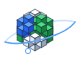

#  AstroClick

**L'exploration du système solaire, cube par cube.**


## 🌌 À Propos

**AstroClick** est une expérience web éducative qui revisite l'astronomie avec une esthétique pixel-art unique. Conçu pour les curieux de tous âges, ce simulateur interactif permet de voyager de Mercure à Neptune, d'apprendre des faits surprenants et d'accéder à une galerie d'images officielles, dédiée au savoir.

Accessible via **[AstroClick.org](https://astroclick.org)** (Domaine fictif pour dev).

## ✨ Fonctionnalités

*   **Visualisation 3D Voxel** : Système solaire complet rendu en temps réel avec une esthétique "Cube".
*   **Mode Double Échelle** :
    *   **Simplifiée** : Vue d'ensemble esthétique.
    *   **Réelle** : Distances respectant les ordres de grandeur.
*   **Aventure Interactive** :
    *   **Soleil Cliquable** : Découvrez notre étoile.
    *   **Planètes & Lunes** : Mercure, Vénus, Terre (avec la Lune !), Mars... jusqu'à Pluton et au-delà.
    *   **Objets Artificiels** : ISS, Télescopes Hubble et James Webb.
*   **Contrôle Total** :
    *   **Temps** : Pause, Avance Rapide (x1, x2, x5).
    *   **Navigation** : Intuitive à la souris ou au tactile.
    *   **Son** : Musique d'ambiance avec contrôle de volume.
*   **Éducatif & Accessible** :
    *   Traductions complètes (FR, EN, ES, ZH, HI).
    *   Données précises (Températures, Distances, Faits).
    *   Galerie NASA intégrée.

## 🛠️ Technologies Utilisées

Ce projet utilise les dernières technologies de développement web et 3D :

*   **[Next.js 14](https://nextjs.org/)** - Framework React performant.
*   **[React Three Fiber](https://docs.pmnd.rs/react-three-fiber/)** - Moteur de rendu Three.js pour React.
*   **[Tailwind CSS](https://tailwindcss.com/)** - Pour le design de l'interface utilisateur.
*   **[Lucide React](https://lucide.dev/)** - Icônes vectorielles modernes.

## 🚀 Installation et Démarrage

Prérequis : Node.js (v18+) installé.

1.  **Cloner le dépôt** :
    ```bash
    git clone https://github.com/votre-user/astroclick.git
    cd astroclick
    ```
2.  **Installer les dépendances** :
    ```bash
    npm install
    ```
3.  **Lancer le serveur de développement** :
    ```bash
    npm run dev
    ```
4.  Ouvrez votre navigateur sur **[http://localhost:3006](http://localhost:3006)**.

## 📁 Structure du Projet

```
/app              # Pages Next.js (page.tsx, layout.tsx)
/components       # Composants React 3D & UI
/data             # Données (solarSystemData.ts, objectTranslations.ts...)
/hooks            # Custom Hooks (useNasaImage...)
/public           # Assets statiques
```

## 📄 Crédits

*   **Données et Images** : NASA Open APIs, Wikipédia.
*   **Audio** : Pixabay.
*   **Concept & Developpement** : AstroClick Team.

---

*Explorez l'univers, un pixel à la fois.* 👾
